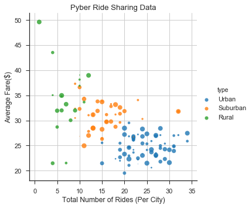
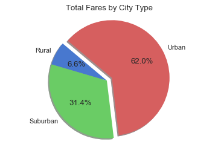
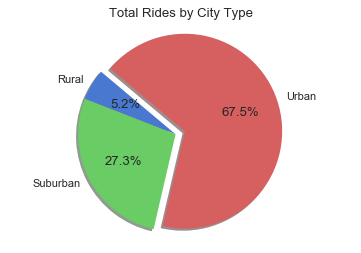
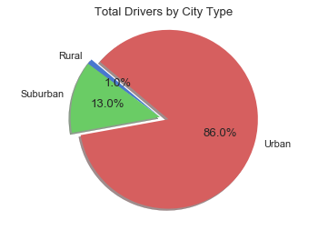

# Analysis

1)  Urban area have a more rides per city than other area, however the average fare is lower.
2)  Rural area have significantly less drivers per city but fares are higher.
3)  Suburban areas are the median for both number of rides per city and average fares.


```python
# Import Dependencies
import matplotlib.pyplot as plt
import numpy as np
import pandas as pd
import seaborn as sns
```


```python
# Import two CSV Files
city_data = "raw_data/city_data.csv"
ride_data = "raw_data/ride_data.csv"

city_data_df = pd.read_csv(city_data)
ride_data_df = pd.read_csv(ride_data)
```


```python
# Preview city_data_df
city_data_df.head()
```


<div>
<style>
    .dataframe thead tr:only-child th {
        text-align: right;
    }

    .dataframe thead th {
        text-align: left;
    }

    .dataframe tbody tr th {
        vertical-align: top;
    }
</style>
<table border="1" class="dataframe">
  <thead>
    <tr style="text-align: right;">
      <th></th>
      <th>city</th>
      <th>driver_count</th>
      <th>type</th>
    </tr>
  </thead>
  <tbody>
    <tr>
      <th>0</th>
      <td>Kelseyland</td>
      <td>63</td>
      <td>Urban</td>
    </tr>
    <tr>
      <th>1</th>
      <td>Nguyenbury</td>
      <td>8</td>
      <td>Urban</td>
    </tr>
    <tr>
      <th>2</th>
      <td>East Douglas</td>
      <td>12</td>
      <td>Urban</td>
    </tr>
    <tr>
      <th>3</th>
      <td>West Dawnfurt</td>
      <td>34</td>
      <td>Urban</td>
    </tr>
    <tr>
      <th>4</th>
      <td>Rodriguezburgh</td>
      <td>52</td>
      <td>Urban</td>
    </tr>
  </tbody>
</table>
</div>


```python
# Preview ride_data_df
ride_data_df.head()
```


<div>
<style>
    .dataframe thead tr:only-child th {
        text-align: right;
    }

    .dataframe thead th {
        text-align: left;
    }

    .dataframe tbody tr th {
        vertical-align: top;
    }
</style>
<table border="1" class="dataframe">
  <thead>
    <tr style="text-align: right;">
      <th></th>
      <th>city</th>
      <th>date</th>
      <th>fare</th>
      <th>ride_id</th>
    </tr>
  </thead>
  <tbody>
    <tr>
      <th>0</th>
      <td>Sarabury</td>
      <td>2016-01-16 13:49:27</td>
      <td>38.35</td>
      <td>5403689035038</td>
    </tr>
    <tr>
      <th>1</th>
      <td>South Roy</td>
      <td>2016-01-02 18:42:34</td>
      <td>17.49</td>
      <td>4036272335942</td>
    </tr>
    <tr>
      <th>2</th>
      <td>Wiseborough</td>
      <td>2016-01-21 17:35:29</td>
      <td>44.18</td>
      <td>3645042422587</td>
    </tr>
    <tr>
      <th>3</th>
      <td>Spencertown</td>
      <td>2016-07-31 14:53:22</td>
      <td>6.87</td>
      <td>2242596575892</td>
    </tr>
    <tr>
      <th>4</th>
      <td>Nguyenbury</td>
      <td>2016-07-09 04:42:44</td>
      <td>6.28</td>
      <td>1543057793673</td>
    </tr>
  </tbody>
</table>
</div>


```python
total_rides = ride_data_df["city"].value_counts()
total_rides_df = pd.DataFrame({'city':total_rides.index, 'ride_count':total_rides.values})
sorted_total_rides_df = total_rides_df.sort_index(by=['city'], ascending=[True])
total_rides_df.head()
```

    /anaconda3/envs/PythonData/lib/python3.6/site-packages/ipykernel_launcher.py:3: FutureWarning: by argument to sort_index is deprecated, pls use .sort_values(by=...)
      This is separate from the ipykernel package so we can avoid doing imports until


<div>
<style>
    .dataframe thead tr:only-child th {
        text-align: right;
    }

    .dataframe thead th {
        text-align: left;
    }

    .dataframe tbody tr th {
        vertical-align: top;
    }
</style>
<table border="1" class="dataframe">
  <thead>
    <tr style="text-align: right;">
      <th></th>
      <th>city</th>
      <th>ride_count</th>
    </tr>
  </thead>
  <tbody>
    <tr>
      <th>0</th>
      <td>Swansonbury</td>
      <td>34</td>
    </tr>
    <tr>
      <th>1</th>
      <td>Port Johnstad</td>
      <td>34</td>
    </tr>
    <tr>
      <th>2</th>
      <td>South Louis</td>
      <td>32</td>
    </tr>
    <tr>
      <th>3</th>
      <td>Port James</td>
      <td>32</td>
    </tr>
    <tr>
      <th>4</th>
      <td>Jacobfort</td>
      <td>31</td>
    </tr>
  </tbody>
</table>
</div>


```python
piechart_data = pd.merge(ride_data_df, city_data_df, on='city')
piechart_data.head()
```


<div>
<style>
    .dataframe thead tr:only-child th {
        text-align: right;
    }

    .dataframe thead th {
        text-align: left;
    }

    .dataframe tbody tr th {
        vertical-align: top;
    }
</style>
<table border="1" class="dataframe">
  <thead>
    <tr style="text-align: right;">
      <th></th>
      <th>city</th>
      <th>date</th>
      <th>fare</th>
      <th>ride_id</th>
      <th>driver_count</th>
      <th>type</th>
    </tr>
  </thead>
  <tbody>
    <tr>
      <th>0</th>
      <td>Sarabury</td>
      <td>2016-01-16 13:49:27</td>
      <td>38.35</td>
      <td>5403689035038</td>
      <td>46</td>
      <td>Urban</td>
    </tr>
    <tr>
      <th>1</th>
      <td>Sarabury</td>
      <td>2016-07-23 07:42:44</td>
      <td>21.76</td>
      <td>7546681945283</td>
      <td>46</td>
      <td>Urban</td>
    </tr>
    <tr>
      <th>2</th>
      <td>Sarabury</td>
      <td>2016-04-02 04:32:25</td>
      <td>38.03</td>
      <td>4932495851866</td>
      <td>46</td>
      <td>Urban</td>
    </tr>
    <tr>
      <th>3</th>
      <td>Sarabury</td>
      <td>2016-06-23 05:03:41</td>
      <td>26.82</td>
      <td>6711035373406</td>
      <td>46</td>
      <td>Urban</td>
    </tr>
    <tr>
      <th>4</th>
      <td>Sarabury</td>
      <td>2016-09-30 12:48:34</td>
      <td>30.30</td>
      <td>6388737278232</td>
      <td>46</td>
      <td>Urban</td>
    </tr>
  </tbody>
</table>
</div>


```python
fare = ride_data_df.groupby("city").mean()
del fare['ride_id']
fare = fare.reset_index()
fare.head()
```


<div>
<style>
    .dataframe thead tr:only-child th {
        text-align: right;
    }

    .dataframe thead th {
        text-align: left;
    }

    .dataframe tbody tr th {
        vertical-align: top;
    }
</style>
<table border="1" class="dataframe">
  <thead>
    <tr style="text-align: right;">
      <th></th>
      <th>city</th>
      <th>fare</th>
    </tr>
  </thead>
  <tbody>
    <tr>
      <th>0</th>
      <td>Alvarezhaven</td>
      <td>23.928710</td>
    </tr>
    <tr>
      <th>1</th>
      <td>Alyssaberg</td>
      <td>20.609615</td>
    </tr>
    <tr>
      <th>2</th>
      <td>Anitamouth</td>
      <td>37.315556</td>
    </tr>
    <tr>
      <th>3</th>
      <td>Antoniomouth</td>
      <td>23.625000</td>
    </tr>
    <tr>
      <th>4</th>
      <td>Aprilchester</td>
      <td>21.981579</td>
    </tr>
  </tbody>
</table>
</div>


```python
ride_share_data = pd.merge(total_rides_df, city_data_df, on='city')
ride_share_data.head()
```


<div>
<style>
    .dataframe thead tr:only-child th {
        text-align: right;
    }

    .dataframe thead th {
        text-align: left;
    }

    .dataframe tbody tr th {
        vertical-align: top;
    }
</style>
<table border="1" class="dataframe">
  <thead>
    <tr style="text-align: right;">
      <th></th>
      <th>city</th>
      <th>ride_count</th>
      <th>driver_count</th>
      <th>type</th>
    </tr>
  </thead>
  <tbody>
    <tr>
      <th>0</th>
      <td>Swansonbury</td>
      <td>34</td>
      <td>64</td>
      <td>Urban</td>
    </tr>
    <tr>
      <th>1</th>
      <td>Port Johnstad</td>
      <td>34</td>
      <td>22</td>
      <td>Urban</td>
    </tr>
    <tr>
      <th>2</th>
      <td>South Louis</td>
      <td>32</td>
      <td>12</td>
      <td>Urban</td>
    </tr>
    <tr>
      <th>3</th>
      <td>Port James</td>
      <td>32</td>
      <td>15</td>
      <td>Suburban</td>
    </tr>
    <tr>
      <th>4</th>
      <td>Port James</td>
      <td>32</td>
      <td>3</td>
      <td>Suburban</td>
    </tr>
  </tbody>
</table>
</div>


```python
final_ride_share_data = pd.merge(ride_share_data, fare)
final_ride_share_data.head()
```


<div>
<style>
    .dataframe thead tr:only-child th {
        text-align: right;
    }

    .dataframe thead th {
        text-align: left;
    }

    .dataframe tbody tr th {
        vertical-align: top;
    }
</style>
<table border="1" class="dataframe">
  <thead>
    <tr style="text-align: right;">
      <th></th>
      <th>city</th>
      <th>ride_count</th>
      <th>driver_count</th>
      <th>type</th>
      <th>fare</th>
    </tr>
  </thead>
  <tbody>
    <tr>
      <th>0</th>
      <td>Swansonbury</td>
      <td>34</td>
      <td>64</td>
      <td>Urban</td>
      <td>27.464706</td>
    </tr>
    <tr>
      <th>1</th>
      <td>Port Johnstad</td>
      <td>34</td>
      <td>22</td>
      <td>Urban</td>
      <td>25.882941</td>
    </tr>
    <tr>
      <th>2</th>
      <td>South Louis</td>
      <td>32</td>
      <td>12</td>
      <td>Urban</td>
      <td>27.087500</td>
    </tr>
    <tr>
      <th>3</th>
      <td>Port James</td>
      <td>32</td>
      <td>15</td>
      <td>Suburban</td>
      <td>31.806562</td>
    </tr>
    <tr>
      <th>4</th>
      <td>Port James</td>
      <td>32</td>
      <td>3</td>
      <td>Suburban</td>
      <td>31.806562</td>
    </tr>
  </tbody>
</table>
</div>


# Bubble Plot of Ride Sharing Data


```python
# Create list from city driver count for sizes
size_list = final_ride_share_data['driver_count'].tolist()

# Scatterplot Style
sns.set_context("notebook", font_scale=1.1)
sns.set_style("ticks")

# Scatterplot Dataframe
sns.lmplot('ride_count',
          'fare',
          data=final_ride_share_data,
          fit_reg=False,
          hue="type",
          scatter_kws={"marker": "o",
                        "s": size_list})
plt.grid(True)
plt.xlabel("Total Number of Rides (Per City)")
plt.ylabel("Average Fare($)")
plt.title("Pyber Ride Sharing Data")
plt.show()
```





# Total Fares by City Type


```python
# Pie Chart of Total Fares by City Type
city_type_total_fares = piechart_data.groupby("type").sum()
del city_type_total_fares['ride_id']
del city_type_total_fares['driver_count']
titles = ["Rural", "Suburban", "Urban"]
explode = [0,0,0.1]
plt.pie(city_type_total_fares, explode=explode, labels=titles, autopct="%1.1f%%", shadow=True, startangle=140)
plt.axis("equal")
plt.title("Total Fares by City Type")
plt.show()
```





# Total Rides by City Type


```python
# Pie Chart of Total Rides by City Type
total_ride_piechart = piechart_data.groupby("type").count()
del total_ride_piechart['date']
del total_ride_piechart['fare']
del total_ride_piechart['ride_id']
del total_ride_piechart['driver_count']
titles = ["Rural", "Suburban", "Urban"]
explode = [0,0,0.1]
plt.pie(total_ride_piechart, explode=explode, labels=titles, autopct="%1.1f%%", shadow=True, startangle=140)
plt.axis("equal")
plt.title("Total Rides by City Type")
plt.show()
```





# Total Drivers by City Type


```python
# Pie Chart of Total Drivers by City Type
# Pie Chart of Total Rides by City Type
total_drivers_piechart = piechart_data.groupby("type").sum()
del total_drivers_piechart['fare']
del total_drivers_piechart['ride_id']
titles = ["Rural", "Suburban", "Urban"]
explode = [0,0,0.1]
plt.pie(total_drivers_piechart, explode=explode, labels=titles, autopct="%1.1f%%", shadow=True, startangle=140)
plt.axis("equal")
plt.title("Total Drivers by City Type")
plt.show()
```




